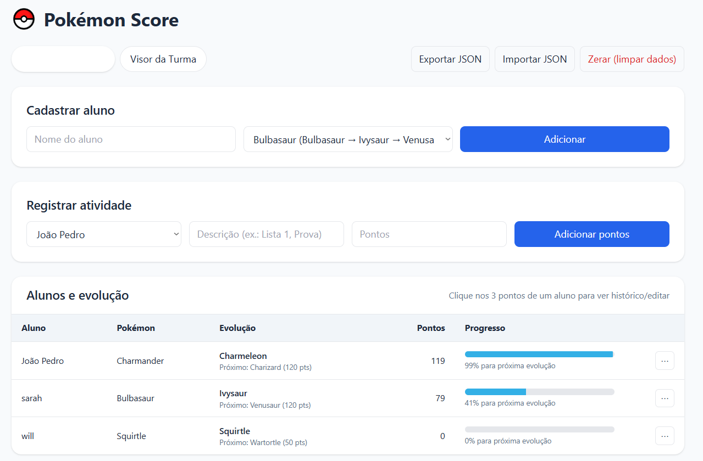

# Pokémon Score

Pokémon Score is a simple web application for classroom gamification.  
Teachers can register students, assign them a starter Pokémon (Charmander, Squirtle, or Bulbasaur), and award points for achievements.  

The app displays two main views:  
- **Teacher Panel**: Register students and add points.  
- **Class View**: Shows the general ranking and the top evolved Pokémon for each species.  

The design includes a Pokéball icon on the page header and tab, with a red theme inspired by Pokémon battles.

---

## Screenshots

### Main Screen

## Features
- Student registration with a chosen Pokémon.  
- Point system to reward progress.  
- General ranking (Top 5 students).  
- Ranking of the most evolved Pokémon by type.  
- Switchable panels (Teacher / Class View).  

---

## Tech Stack
- **HTML + TailwindCSS** for structure and styling  
- **JavaScript** for dynamic updates  
- **LocalStorage** for data persistence  

---

